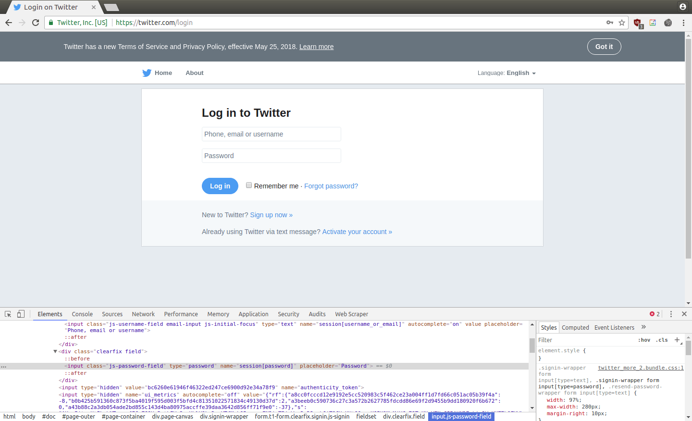
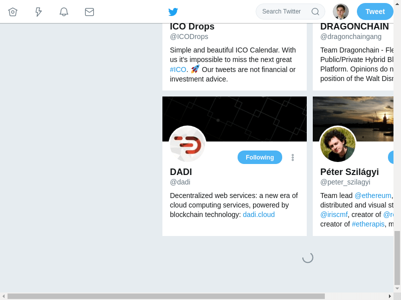

## Overview

[Selenium](https://github.com/SeleniumHQ/selenium) is a high level browser automation software that is fairly robust. It uses the [Webdriver API](https://www.w3.org/TR/webdriver/) and can interact with just about any browser, on any OS, and is compatible with many different [testing frameworks.](https://www.seleniumhq.org/about/platforms.jsp#testing-frameworks) Selenium can be used in the context of testing or web scraping, and Google recently released the [headless version of the Chromedriver](https://www.chromestatus.com/features/5678767817097216). Up until now, the leader of the space was [PhantomJS](https://github.com/ariya/phantomjs), which is used by companies such as Twitter and Netflix for testing purposes. But Chrome is much faster, most stable, and uses considerably less memory than Phantom JS.

In the world of webscraping, headless browsers are very useful, especially if you're dealing with JavaScript heavy websites. The benefit is that using an actual browser can give you different results than if you were just fetching data from API endpoints. To a server, you appear in the same way a regular user would, which can be desirable in many circumstances. Although, I will say that Selenium isn't for everything. Don't go out and switch all your scraping projects to use Selenium. But it has its uses, and it's a powerful tool. In this post we'll be using both regular Chrome and the headless Chrome Driver.

## Setup

To get started the first thing we need to do is get the version of Chrome that has the headless capabilities. Download [Chrome](https://www.google.com/chrome/) if you don't already have it for some strange reason, or you can download the [ChromeDriver](https://sites.google.com/a/chromium.org/chromedriver/downloads) binaires for your system. If you're on linux, Chrome should be in /usr/bin/ as google-chrome-stable. I liked to have the chromedriver binaries separate in /user/local/bin. This will be important when we switch between the regular and headless version.

First let's make a directory for the project to be in. You can create a virtualenv if you want to, but for the sake of this article, I won't be. Then install selenium.

```bash
$ mkdir ~/scraping/twitter
$ cd ~/scraping/twitter

//If you want to use a virtualenv
$ virtualenv env
$ . env/activate

$ pip install selenium</pre>
```

## Configuring

Let's open our text editor and get started writing the configurations. I use [Visual Studio Code](https://code.visualstudio.com/download), but you can use whatever you want. [Atom](https://flight-manual.atom.io/getting-started/sections/installing-atom/) and [Sublime](https://www.sublimetext.com/3) are two other really good ones, but I really recomment VSC. The extensions are really easy to use and are great, it's open source, etc. First, let's leave headless out of this. We'll get to it in a minute, but doing it without headless first is a good way to show you want the program is actually doing. And who doesn't like seeing a computer open up browsers and type things by itself. If you don't think that's cool, you're lying.

We're going to import Selenium and get the driver location:

```python
from selenium import webdriver

driver = webdriver.Chrome('/usr/local/bin/chromedriver')
```


## Interact with Twitter

First, we need to tell our program to go to a website of our choosing, in this case we want https://twitter.com/login. Remember to add the https or http or it won't work.

```python
driver.get('https://twitter.com/login')
```

Now we're going to need to find selector for the username and password box. Normally, you can use any selector with Selenium; CSS, ID, Name, etc. But for now I'm going to stick to CSS.

Open the site you want to log into, open the developer tools, and select the input boxes. Twitter's username selector is actually pretty long for some reason.



Great, so now we're going to use driver.find_element_by_ and .send_keys to make Selenium log in for us. Also, we can add driver.quit() at the end to have the browser automatically close. Try once with and once without to see how it works and how everything looks. If you do use it, you'll be surprised by how quickly it logs you in and then flashes closed.

```python
userfield = driver.find_element_by_css_selector('.js-username-field.email-input.js-initial-focus')
userfield.send_keys('JustinFormentin')
passwordfield = driver.find_element_by_css_selector('.js-password-field')
passwordfield.send_keys('hunter2')

passwordfield.submit()
```

See how easy that was? 9 lines of code to log you in. Now let's move on to the headless version, and add a few more things.

## Headless Chrome

Comment out or delete the driver section at the top, and we're going to use the path to Chrome instead of the chromedriver, and then add the headless argument.

```python
from selenium import webdriver

#driver = webdriver.Chrome('/usr/local/bin/chromedriver')

options = webdriver.ChromeOptions()
options.binary_location = '/usr/bin/google-chrome-stable'
options.add_argument('headless')
driver = webdriver.Chrome(chrome_options=options)
```

So you see we got rid of the chromedriver and added the four lines allowing us to use the headless version of Chrome. Now, we're going to test this out and get some proof it's working, even though we can't see it working in the browser. After the passwordfield.submit() we're going to go to the page that lists all the people I'm following, we're going to scroll down to load more, and then take a screenshot to give us proof.

```python
driver.get('https://twitter.com/JustinFormentin/following')

driver.execute_script("window.scrollTo(0, 10000);")

driver.get_screenshot_as_file('followers-page.png')
```

We run it, we wait for it to finish, and then if we look in our directory, we can see that we now have a screenshot!



Yes, it's a pretty silly screenshot, but it proves that it could login, navigate to my following page, scroll down, and take a screenshot. The full code should now look like this:

```python
from selenium import webdriver

options = webdriver.ChromeOptions()
options.binary_location = '/usr/bin/google-chrome-stable'
options.add_argument('headless')
driver = webdriver.Chrome(chrome_options=options)

driver.get('https://twitter.com/login')

userfield = driver.find_element_by_css_selector('.js-username-field.email-input.js-initial-focus')
userfield.send_keys('JustinFormentin')
passwordfield = driver.find_element_by_css_selector('.js-password-field')
passwordfield.send_keys('hunter2')

passwordfield.submit()

driver.get('https://twitter.com/JustinFormentin/following')

driver.execute_script("window.scrollTo(0, 10000);")

driver.get_screenshot_as_file('followers-page.png')

driver.quit()</pre>
```

Now this is just the very basics, but hopefully you now have an idea of Selenium's power. If you go to [Selenium's Documentation](https://www.seleniumhq.org/docs/03_webdriver.jsp) page, you can see a lot of what you can do with it. Also, if you prefer other languages, they have the examples for Java, JavaScript, Ruby, C# and Perl.