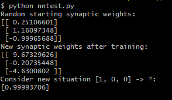

## Overview

In this post I want to give a fairly brief example of a simple single layer feedforward neural network, the [perceptron.](http://computing.dcu.ie/~humphrys/Notes/Neural/single.neural.html) The perceptron is called "feedforward" because the data flows in only one direction. The inputs for the perceptron incorporate the idea of weights. When given a training set of input-output examples, the program should learn a function by increasing or decreasing the weights continuously depending on the output of each example.


These weight values are mathematically applied to the input in such a way that after each iteration, the output prediction gets more accurate. To show an example of this, we can write some python and use only numpy.  

## Main Function

Here we will make the neural network which we will later define as its own class. Then we will print out the starting weights. They each have 3 input values and 1 output value. Using the T function, we transpose the matrix from horizontal to vertical.

```python
if __name__ == "__main__":

    # Initialize a single neuron neural network
    neural_network = NeuralNetwork()

    print("Random starting synaptic weights: ")
    print(neural_network.synaptic_weights)

    # The training set. We have 4 examples, each consisting
   # of 2 input values and 1 output value
   training_set_inputs = array([[0, 0, 1], [1, 1, 1], [1, 0, 1], [0, 1, 1]])
   training_set_outputs = array([[0, 1, 1, 0]]).T
```

We'll train our neural network using these values so that when given a new list of 1s and 0s, it will be able to predict if the output should be a 1 or 0\. Because we're identifying which category it should belong to, this is considered a classification task. We'll now train our network on this data by using them as arguments to our train function, and set the amount of iterations to 10000\. Once done training, we'll print out the updated weights so we can compare them and finally, we will predict the output given a new input.

```python
    neural_network.train(training_set_inputs, training_set_outputs, 10000)

    print("New synaptic weights after training: ")
    print(neural_network.synaptic_weights)

    print("Consider new situation [1, 0, 0] -> ?: ")
    print(neural_network.predict(array([1, 0, 0])))
```

## Define Neural Network

Now that our main function is complete, we can define out Neural Network class. When we initialize the class, the first thing we want to do is seed it. This is to make sure it generates the same numbers every time the program runs. This is useful for debugging later on. We'll assign random weights to ta 3 x 1 matrix with values in the range of -1 to 1 with a mean of 0.

```python
from numpy import exp, array, random, dot

class NeuralNetwork():
    def __init__(self):
        random.seed(1)
        self.synaptic_weights = 3 * random.random((3,1)) - 1
```

Next we'll write out our activation function. In our case, we'll use a sigmoid, which describes an S shaped curve. We pass the weighted sum through it and it will convert them to a probability between 0 and 1.  This probability will help make our prediction.

```python
    def __sigmoid(self, x):
        return 1 /(1 + exp(-x))
```

We'll use our sigmoid function directly in our predict function which takes inputs as parameters and passes them through our neuron. To get the weighted sum of our input, we'll compute the dot product of our inputs and our weights. This is how our weights govern how data flows in our neural network and this function will return our prediction.

```python
    def predict(self, inputs):
        return self.__sigmoid(dot(inputs, self.synaptic_weights))
```

Now we can write our train function. We'll write a for loop to iterate 10000 times as we specified earlier, then use our predict function to pass the training set through the network and get the output value, which is our prediction. We'll then calculate the error which is the difference between the desired output and our predicted output. We want to minimize the error as we train and we do this by iteratively updating our weights. We'll calculate the necessary adjustment by computing the dot product of our input's transpose and the error multiplied by the gradient of the sigmoid curve. So less confident weights are adjusted more, and inputs that are 0 don't cause changes to the weights. This process is called gradient descent. So, first we need to write out the function that calculates the derivative of our sigmoid, which gives us our gradient, or slope. This measures how confident we are of the existing weight value and helps us update our prediction in the right direction.

```python
    # Gradient of the sigmoid curve 
    def __sigmoid_derivative(self, x): 
        return x * (1 - x)

    def train(self, training_set_inputs, training_set_outputs, number_of_training_iterations):
        for iteration in range(number_of_training_iterations):
            output = self.predict(training_set_inputs)

            # Calculate the error
            error = training_set_outputs - output

            # Multiply the error by the input and again by the gradient of the sigmoid curve
            adjustments = dot(training_set_inputs.T, error * self.__sigmoid_derivative(output))

            # Adjust the weights
            self.synaptic_weights += adjustments
```

We'll also write out the function that calculates the derivative of our sigmoid, which gives us our gradient, or slope. This measures how confident we are of the existing weight value and helps us update our prediction in the right direction. We'll add this under our original sigmoid.

```python
    def __sigmoid(self, x):
        return 1 /(1 + exp(-x))

    # Gradient of the sigmoid curve
    def __sigmoid_derivative(self, x):
        return x * (1 - x)
```

Once we have our adjustment, we'll update our weights with value. This process of propagating our error value back into our network to adjust our weight is called [backpropagation](http://neuralnetworksanddeeplearning.com/chap2.html). In the end, the full code should look something like this:

```python
from numpy import exp, array, random, dot

class NeuralNetwork():
    def __init__(self):
        random.seed(1)

        self.synaptic_weights = 3 * random.random((3,1)) - 1

    def __sigmoid(self, x):
        return 1 /(1 + exp(-x))

    def __sigmoid_derivative(self, x):
        return x * (1 - x)

    def train(self, training_set_inputs, training_set_outputs, number_of_training_iterations):
        for iteration in range(number_of_training_iterations):

            output = self.predict(training_set_inputs)

            error = training_set_outputs - output

            adjustments = dot(training_set_inputs.T, error * self.__sigmoid_derivative(output))

            self.synaptic_weights += adjustments

    def predict(self, inputs):
        return self.__sigmoid(dot(inputs, self.synaptic_weights))

if __name__ == "__main__":

    neural_network = NeuralNetwork()

    print("Random starting synaptic weights: ")
    print(neural_network.synaptic_weights)

    training_set_inputs = array([[0, 0, 1], [1, 1, 1], [1, 0, 1], [0, 1, 1]])
    training_set_outputs = array([[0, 1, 1, 0]]).T

    neural_network.train(training_set_inputs, training_set_outputs, 10000)

    print("New synaptic weights after training: ")
    print(neural_network.synaptic_weights)

    print("Consider new situation [1, 0, 0] -> ?: ")
    print(neural_network.predict(array([1, 0, 0])))
```

Let's test it.



Because the training set is so small, it took only milliseconds to train.  We can see that our weight values updated themselves after the iterations and when fed a novel input, it predicted that the output was likely a 1. You can find the finished code on my [Github.](https://github.com/justinformentin/simple-neural-network)