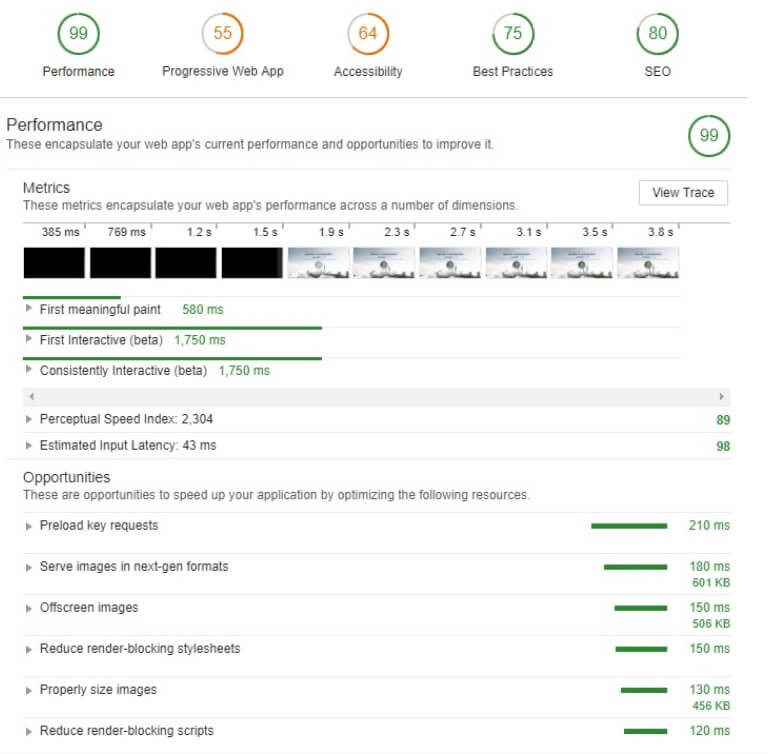

[Google PageSpeed](https://developers.google.com/speed/pagespeed/insights/) is a useful tool that gauges the speed of your site, but it shouldn't be taken as gospel. First of all, it doesn't look at your website as a whole and it doesn't take certain things under consideration. It really just looks at your site's code, compares it to a checklist, and then spits out a number. Since it just reads the HTML on your page, you can sometimes get confusing results like when one site loads in 2 seconds but gets a 60, and then another site loads in 8 seconds but gets in the 80s.

## Render Blocking

One major reason you'll get points taken off  is render blocking components. You're warned that you have x number of render blocking scripts and styles, but sometimes they're not worth "fixing". When your browser loads a web page, some CSS and JavaScript files prevent the page from being displayed until all the necessary files are loaded fully. This is a good thing. If you were to make your site load HTML or JavaScript before any styling, you would get the gross ["flash of unstyled content"](https://www.techrepublic.com/blog/web-designer/how-to-prevent-flash-of-unstyled-content-on-your-websites/). Nobody wants to see that. So unless you have tons of unnecessary render blocking elements that you could do without, it's usually better to have your users wait a few hundred milliseconds rather than show them your naked HTML. At the end of the day, UX is more important than fractional seconds.

## Minification

Digging a little deeper, what they "want" you to do is to minify the resources and deliver them inline. That's all fine and good for a static, single page site with a few files, but god help you if the site is large, complex, old, or a combination of the three. Good luck maintaining it and not breaking it or having bugs. If everything else is optimized and the page fully renders in a couple seconds, then you shouldn't worry about getting docked a few points here.

## Heavy Scripts

Another incredibly common issue that gets you points taken off is using Google Analytics and Google fonts. Yes, you read that correctly, **Google** PageSpeed penalizes you for using **Google** Analytics and **Google** fonts. That would be hilarious if it wasn't such a pain. Although, something to consider is one of Google Fonts' selling points - caching. Sure, it's very heavy, but it's so ubiquitous that you can be fairly certain the majority of your site's visitors will already have them cached. So, once again, don't worry about that.

## Don't Worry So Much

My point is that you shouldn't worry so much about these scores. Should you be worried if your site takes twenty seconds to load? Of course. But you should really look at your pagespeed as more of a list of suggestion. If it points out some very wrong, fixable issues, then of course you're going to want to work on getting those sorted out. But if you're using caching, your images are compressed, and you're not using unnecessary CSS and JavaScript, you're probably alright.

Regarding testing your site, real accuracy is gaining insight from multiple sources. It's true for reading the news and getting a second opinion from a doctor; it's true for your page speed as well. In addition to [PageSpeed Insights](https://developers.google.com/speed/pagespeed/insights/), you can use [Pingdom](https://tools.pingdom.com/) and [GTMetrix](https://gtmetrix.com/). Another great tool is [Google Lighthouse](https://developers.google.com/web/tools/lighthouse/), which gives you way more information. You can see what your site scores in accessibility, SEO, best practices, performance, and PWA.

Even google.com has a 92/100 for desktop and 62/100 for mobile. Youtube has a 70 and 51. Facebook has a 79 and 48. Obviously these sites are probably not similar to yours, but if your boss or client is demanding scores of 100 across the board, just show them this article.

Or you can build your site with React using Gatsby; this site was built with Gatsby and scores 100 in every single category of the Lighthouse Audit.

You can read my full guide on how to build a full site using Gatsby in [this article](https://justinformentin.com/guide-to-building-a-gatsby-site).
