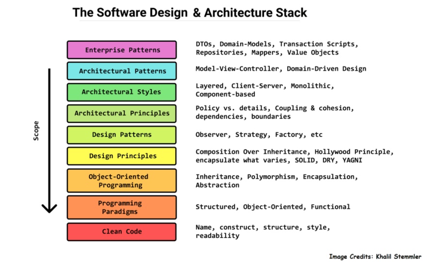
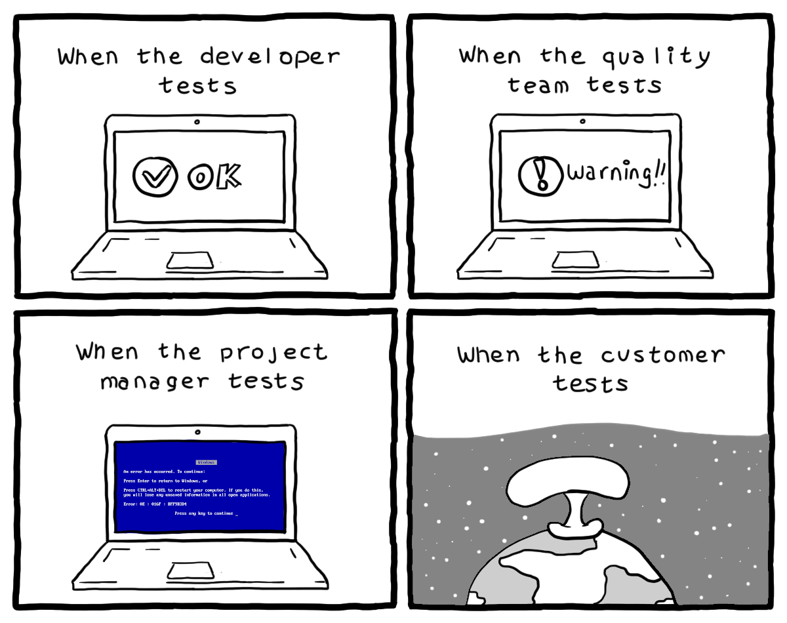
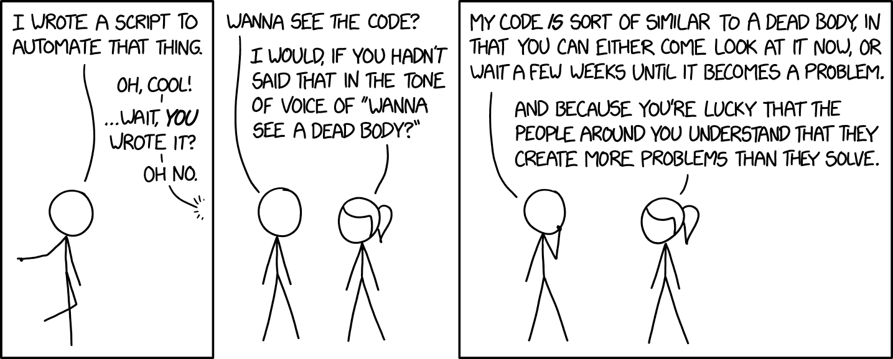

Over the years I've made mistakes, I've learned some hard lessons, and I've been given a lot of good advice.

This is a list of tips, tricks, facts, opinions, and ways of thinking that I wish I knew earlier.

## Leave code better than you found it.

Everything you do should be an improvement. Code quality, test coverage, documentation, etc.

If you're refactoring, delete code that isn't getting used anymore. If you're working on something you've never done before, research existing implementations. If you're doing anything non-trivial, add a test and some documentation.

Before you submit a PR, look over your code a few more times. If you can't honestly say that you've improved the codebase, even a tiny bit, go back and figure out how you can make it better.

### Do it right the first time.

I don't mean you should be perfect and never get anything wrong. You will make mistakes, and that's fine. What I mean is that you should put in the amount of effort you will be proud of, and try to write the best code you can given your abilities and time constraints.

Anyone can just throw together hacky code that's held together with shoelaces and gum. "It works today, I'll get back to it and clean it up later." You won't. It will inevitably need to be fixed in the future. Some poor bastard will need to make sense of your Frankenstein's monster, and often that poor bastard will be you.

As codebases and companies grow larger, going back to fix old code becomes increasingly difficult and time consuming. As the old Russian proverb goes:

> There is nothing more permanent than a temporary solution

Code becomes intertwined, and people might depend on the behavior of the workaround. As time elapses, the cost per line of code grows exponentially.

If you make a few mistakes and cause bugs, that's fine. You can always go back and fix them. If you fundamentally architected large chunks of code poorly, going back and refactoring is significantly more difficult.

## Learn design patterns early

Learning design patterns early gives you a higher chance of writing "better" code the first time. The reason why similar design patterns exist in most languages is because they provide solutions to common problems. You likely make use of some design patterns in your work without even realizing it.

I recommend looking through [refactoring.guru design pattern catalog](https://refactoring.guru/design-patterns/catalog) and [dofactor's design patterns](https://www.dofactory.com/javascript/design-patterns).

If you don't know any design patterns off the top of your head, I guarantee that looking through the examples on these sites will trigger some realizations about code you previously wrote.

It also improves your ability to communicate with cross platform teams. Other co-workers using different languages might not know what you're talking about if you reference specific syntax, but they would if you mention design patterns.

Some design patterns are language/paradigm dependent, but that shouldn't dissuade you from learning as much as you can. That's rarely the case, and knowing at least the major ones will allow you to have conversations about more abstract ideas with people that aren't working in your language.

## Look to the past

Speaking of design patterns, it's important to understand that you stand on the shoulders of all of the people that have collectively put millions of hours into designing and building all the hardware, software, networking, infrastructure, whatever, that you use and build upon.

The reason why today you can write a few lines of code, run a few commands, and have something tangible show up on your browser or phone is the combined effort of everyone that has come before you.

We're here today because of rules, guidelines, fundamentals, and designs patterns. You should use them to your advantage.

### Do not reinvent the wheel.

This phrase might be overused, but it will always be true. Unless you are creating something truly unique, chances are good that someone else has already solved the problems you have.

It doesn't matter if the problem you're trying to solve is philosophical, architectural, or if you're just having trouble implementing a feature. It is highly likely that it's already been solved, and you just need to find the solution.

Spending time doing research will pay dividends. Not only will you save time with your work, you'll learn things that will help with future work.

## Write disposable and loosely coupled code

You should write code in a way that makes it easy to delete or change chunks of it on the fly. Your future self will thank you. One of the more difficult parts of adding features to a large, mature codebase is often detangling the months or years worth of interwoven code.

This is challenging in practice because it requires a few steps and some discipline.

**Plan ahead**

You can't see the future, nobody can (sorry psychics). Since you don't know what code you'll be writing next week, month, or year, it's important to guard against writing code that is too interdependent.

The difficulty stems from the fact that the definition of "interdependent" in this context is nebulous. How do you know if you're writing code that is too tightly coupled if you haven't written most of it yet?

**Write small unit tests**

One way is to write unit tests with your code, and make each test as small as you can. If you are adding a complex feature to your codebase, you'll naturally want to break it down into smaller, more manageable chunks anyway.

Instead of writing one larger test for the feature as a whole, write tests for each small piece of code. The smaller pieces of code need to stand on their own to be tested effectively, and so doing this will encourage writing loosely coupled code.

**Not becoming too attached to your code**

The real crux of "writing disposable code" is embodying the philosophy that your code is a means to an end. The code is not the product, and you are not your code. You should feel free to delete, re-write, and refactor.

## Always write tests.

It doesn't matter what code you wrote, there should be test coverage to back it up. This improves confidence in your code, reduces bugs, makes it easier to debug, makes it easier to refactor, and makes it easier for other people to understand your code.

You don't need to follow any arbitrary rules like "80% test coverage". What is important is that you're writing tests in a way that allow you to confidently make changes to your code when you need to refactor, or if something breaks. Because your code will break. All the time.

If refactoring large chunks of code makes you nervous, or there are regressions every other release, it means you don't have enough test coverage.

Tests are also the front line of documentation. You should be able to understand what code does just by reading the tests.

## Write documentation.

Write comments, and write documentation. No, your code isn't self documenting. If you think you shouldn't write any comments anywhere, I'm sorry to tell you that [you're mistaken](/code/self-documenting-code).

It's true that getting better at [naming things](/code/naming-things) and improving the structure of your code should eliminate the need for many comments. But there is a time and place for writing them, and they're often most useful when explaining the **why** behind some code instead of the **how**.

Long form documentation should be written when more complex explanations are necessary or you need to explain whole feature sets to people not in your immediate team.

### Write internal documentation for other developers

Maybe your codebase uses a library that isn't very widespread, or it uses a modified version of another. Maybe you've learned some tips and tricks working in the codebase.

Write them down in a document and share them with your team. It will help your co-workers, it will help a new hire get situated more quickly, and it will especially help you when you need to reference old code in the future.

### External documenation

You should try to write documentation in a way that can be understood by someone who isn't an expert in that language, tool, or library. It should include explanations and examples that make it easy for someone to take your code and test it out quickly.

### Proof of Concept

For larger features added in your codebase, documentation should often be written first, in the form of a proof of concept. Why waste time writing code when your idea is off or plain wrong?

Write down what you're planning to code with a few explanations and snippets. Then have other developers review it. You'll either get a thumbs up and you can move forward with your plans, or your co-workers will ask questions, offer advice, point out flaws and inconsistencies, or talk about general improvements.

These comments might give you a different point of view, or help you with part of your task. And in the end, you'll have an outline of exactly what code you should write. It's a win-win.

## Automate as much as you can

Everybody makes mistakes, and the more manual a process is, the more room there is for human error.

The more tasks you can convert to CI/CD tasks, scripts, whatever, the better. Tasks like testing, building for deployment, git functions, publishing, or generating documentation.

If it's running from a script, you always know what you're getting. If you do it yourself, just by the laws of statistics you're going to mess something up eventually.

## Use a coding standard.

It doesn't matter which one, you just need to use one. Collaboration is easier when everyone is on the same page, and the code all looks the same. Use tools like prettier in JavaScript, and autopep8 in python.

## Code Review

All PRs should be reviewed by at least one other developer. In smaller companies, sometimes all you can get is one more set of eyes. In larger companies you should get a second, or third. If you're the only developer, you should look to one of your direct reports, managers, etc who has experience in your area and would be able to give feedback.

If you don't have that, you're most likely at a small company or startup, and the only thing that really matters is getting a working product yesterday, code reviews be damned.

### Don't be a syntax stickler

If you're doing a code review, don't nitpick stylistic choices, and don't ask someone to change the structure of something because it's not exactly the format you prefer.

If it works, meets the requirements, doesn't cause any bugs, and isn't written so horribly it makes your eyes hurt, just let it go. You should already have some form of auto formatting in place anyway.

### Offer constructive feedback

If you don't have anything nice to say, change the way you say it.

There are many ways you can tell someone their code sucks, but that doesn't help anyone; it makes you look like an ass, nobody will want to work with you, and you'll make others feel badly.

Instead, figure out a way to give helpful feedback where the receiver has actionable items to improve.

This is obviously beneficial for the company in the long run because your colleagues will hopefully improve, and you'll contribute to a more cooperative environment.

In reality, companies will almost always hire the person with less experience who is easier to get along with over the jerk that's an expert.

### Learn to take criticism

Don't take things personally. If someone points out issues with your work, and does so **constructively**, as an emotionally mature individual you should be able to separate yourself from your work. You are not your code, so criticizing your code is not a criticism of you as a person.

You should seek out criticism because nobody lives in a vacuum. A different point of view will often help you.

The reality is that if you're part of a team that shares a common goal, the goal is what is important.

If someone gives you feedback on your work, it's usually with the end goal of improving the product in mind, and not because your co-workers want to make you feel badly.

Although if that is the case, I'm sorry, and you should consider looking for another job.

## Write everything down

It doesn't matter how good your memory is, you will never remember everything perfectly. If you're responsible for more than one thing at a time, it can only be beneficial to write down as much as you can.

Write down the details of tasks you need to complete, what's expected of you, what you plan to do, ideas along the way, and things you need to remember to do later.

Your work will greatly improve when you have something physical that you can reference instead of just trying to remember everything.

## No unfinished work

Do not leave bugs or TODO comments in your codebase. If you are tempted, you should instead do one of two things.

If it's a straightforward task, just do it now. You're in a unique position where you have more information than anyone else and you see what needs to be done.

If you choose to leave a TODO or a comment about a bug, someone else will need to spend extra time just getting to where you are right now in terms of knowing the situation. Since you're already there with full knowledge, just fix it.

If it's more complex and requires additional thought or refactoring, create a ticket so it can be tracked. Don't get in the habit of leaving them or else they'll just increase in number, possibly being put off indefinitely.

## Time Prioritization

If you find yourself constantly not finishing tasks on time, or finishing tasks early, you should reflect on those experiences. Use them to adjust your time estimations.

A general rule of business you'll hear a lot is "under promise, over deliver". This is true in this case, but not for the purpose of making you look good. It's to give yourself more breathing room, and as a result, make your entire team more efficient.

Think of your place in the team, and how your work affects others. If you're behind, you might need to pull someone else in for help. You might cause a delay that throws off another teammate's schedule.

It might seem counterintuitive at first, but padding your estimations with extra time for the unexpected will often speed up development and help your team flow more smoothly.

## Learn how to ask for help.

Everyone needs to ask for help sometimes, and that's fine. There is a certain way you should ask for help, though. The main rule is "people will help those who help themselves". Just look at Stack Overflow questions if you want to see this in action.

If you ask someone "How do I fix this bug?", you won't find help easily.

Instead, your question should be formatted in a way similar to this:

> "I am trying to do X, but I am having an issue with Y. I have tried A, B, and C. Do you have any advice on how I can get X working".

Posing your question this way is more conversational. It makes it easier for someone to start helping you, and it allows them to continue the conversation.

You first explain what you're doing to give context, then explain exactly what issue you're having, and finally you explain what you have tried in an effort to solve your problem.

This accomplishes two goals, it shows that you have put in some effort and aren't just trying to get someone to do your work for you, and it gives more information that might make it easier for the person to help.

## Have public conversations

Overshare. I guarantee that needing to extract bits of information from you is much more annoying than reading a slightly long message you sent. Try to give all pertinent information up front.

Avoid siloing. Try to keep conversations as public as possible. Having public discussions and sharing information can be beneficial in ways you wouldn't expect, even if you think the topic is only pertinent to your immediate teammates.

Others can comment and offer different perspectives, or they may see your conversation and get ideas that will help them with their work.

Especially now that many people are working from home, it's more important than ever to include as many people in your discussions as you can.

## How to actually be a better software engineer

This article is really only meant to scratch the surface. You could easily write full articles for each section. But the ideas are simple when broken down to their core components. Communicate effectively, be able to learn on your own, and for the love of god write tests and documentation.
