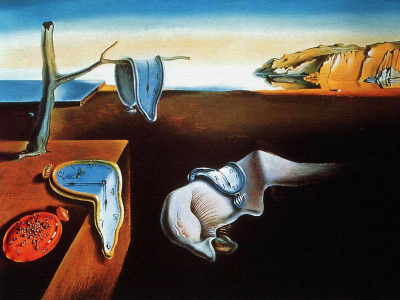
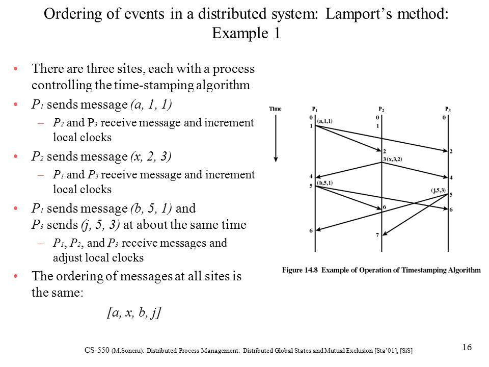
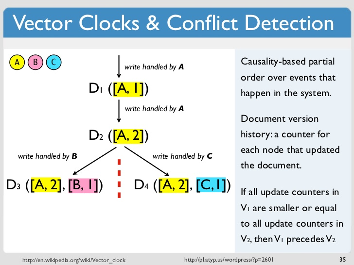

A bug was reported in our SDK a while ago, and I wanted to document what the issue was and the steps I took to fix it. I thought it was interesting because the solution is related to a concept that is pretty much unheard of on the frontend, but considered fundamental on the backend.

## The Bug

One feature of the SDK is a number of Web Components that connect to our backend. We use a third party message broker for real time data. The issue we were having was on page refresh, the SDK would receive a message that was a duplicate of a message recently received before refreshing the page. This didn't happen all the time, but obviously we can't have duplicate messages.

The bug affected our clients, so contacting our messaging broker's support team was a necessary step, but this issue needed to be at the very least patched as soon as possible.

## The Challenges

One challenge is that our SDK allows you to have multiple, nearly identical web components on the page. Identical in the sense that they're connected to the same backend source, have the same properties except for a UUID, and share a message broker instance, but they might have different styles or UI.

Instead of sharing a message broker instance, why not give each element its own instance? I won't go into the secret sauce, but the short answer is we can't do this because of certain important metrics.

Another issue is that it is possible for messages to be almost identical except for a unix timestamp.

## Working through the issues

This happened a little while ago, so the following is a rough re-creation of my thought process at the time.

Knowing the challenges, I tried to work through a list of things that might help.

When receiving a message, I know the unique piece of data is the unix timestamp. I can save the timestamps in localStorage so it'll persist when reloading the page.

Any time the element receives a message from the message broker, it can just check the received timestamp against the saved timestamp. If the received timestamp is newer, it's not a duplicate and I can update the saved timestamp with the newer timestamp.

Very basically, the idea is something along the lines of this:

```js
const checkMessage = (newTimestamp) => {
  const prevTimestamp = localStorage.getItem('timestamp');
  if (!prevTimestamp || newTimestamp > prevTimestamp) {
    localStorage.setItem('timestamp', newTimestamp);
    return true;
  }
  return false;
};
```

This doesn't work because one element will always be the first to call `checkMessage`. This is guaranteed to happen every time because of how JavaScript's call stack works. If you make multiple function calls at the same time, they will run one at a time, one after another.

Our `checkMessage` function will work only the first time it's called. If the message is a duplicate, it will return false, and if it's a new unique message, it will update the localStorage and return true.

But what happens when the next element's `checkMessage` fires? The `prevTimestamp` it's checking will actually be the new timestamp that was just updated in the previously run `checkMessage`. It will always return false because `newTimestamp > prevTimestamp` will always be false since both are the same value.

What about just changing that check to be `newTimestamp >= prevTimestamp`? That also won't work since every subsequent `checkMessage` call will always return true because the `newTimestamp` and `prevTimestamp` value will be the same.

Maybe I can key the elements/timestamp? Unfortunately, that's not possible. Both the elements and the received messages can have identical properties except for the UUID on the element, and the timestamp in the message. The UUIDs _are_ being used for things like keying events, but they are generated on page load so refreshing the page would result in different UUIDs. The only actual unique and persistent piece of data is the message timestamp.

What if I instantiated the elements each with the copy of the saved timestamps? Any time new messages come in, the `checkMessage` would occur only within the element instance and the elements would update their local copy of the timestamp.

This would actually work for as long as you keep the page open, but it would be useless when refreshing the page. The previously saved timestamp needs to come from one source, and so it needs to be set to one source. How do we know when to update that one source? How do we know when all of the checks are finished?

We need some type of sequence, or a way to keep count. I wrote a rough function to do this. The basic idea was to maintain some form of update counter and queueing system. When the single events were received, the _n_ number of elements would be "aware" of the sequence of checks and would be able to calculate which events can be used or thrown away.

It worked on the surface, but I wasn't totally confident in the implementation. I thought that a solution to this problem must exist somewhere, and [I shouldn't be badly reinventing the wheel](./better-software-engineer#do-not-reinvent-the-wheel).

I described the issue to my coworkers and I was immediately pointed to look into a "Lamport Clock" (thanks JP!).



## Lamport Timestamp

A ["Lamport Clock" or "Lamport Timestamp"](https://en.wikipedia.org/wiki/Lamport_timestamp) is a logical clock algorithm that is used in distributed systems to determine order of events and synchronize processes.

But how does this help me?

Taken from the wikipedia page, it is described as

> a clock that only has meaning in relation to messages moving between processes. When a process receives a message, it re-synchronizes its logical clock with that sender.

That sounds exactly like what I need.

A logical clock in this context is essentially a count of events that are witnessed, and the function of the Lamport timestamp is to order them properly.



Managing the ordering of events is such a fundamental concept in distributed systems, that I'm sure most backend or systems engineers have either heard of or used a Lamport clock in their work.

One very common example would be keeping an accurate timeline for database operations. This isn't an issue on a single machine because all events will share the same physical clock. However, if you have a hundred machines all making insertions at different times, you can't go by their physical clocks anymore because there's no guarantee they're in sync.

## Vector Clock

There is also something called a ["Vector Clock"](https://en.wikipedia.org/wiki/Vector_clock) which is related to a [Lamport timestamp](https://lamport.azurewebsites.net/pubs/time-clocks.pdf), but differs slightly. If you remember linear algebra from school, a vector is the displacement between two points. A Vector Clock deals with an array of integers, instead of a single integer like the Lamport timestamp.

One important difference is that a Vector Clock is used to determine if events are causally dependent or if they're concurrent, while a Lamport timestamp is used more for overall ordering. Vector clocks are often used for **conflict resolution**.

That's a very simplified explanation, but I'm most interested in the part about conflict resolution. Conflicts between two independent elements receiving identical duplicate events is exactly the issue I'm having.



Amazon's original Dynamo, which managed the Amazon shopping cart, used Vector Clocks. You can read more about this in the paper by [Amazon's Werner Vogels](https://www.allthingsdistributed.com/2007/10/amazons_dynamo.html).

There isn't a lot of prior art for Lamport timestamp or Vector Clock implementations in client side JavaScript, which was unsurprising. So I widened my search and took a look at some different examples in Java, Python, and Go just so I could get an idea of what an implementation would look like.

After looking through a lot of different papers and open source repos, I found the [Virtual Time and Global States of Distributed Systems](https://pages.cs.wisc.edu/~remzi/Classes/739/Fall2016/Papers/mattern89.pdf) paper written by Friedemann Mattern to be the most helpful. Mattern includes multiple diagrams, theorems and explanations broken down in a way that I found easy to digest.

From page 7 in the 'Vector time' section:

> Ticking is considered to occur before any other event action, and the timestamp C(e) of an event e is the clock value after ticking ... each message gets a piggybacked timestamp consisting of the vector of the local clock. By receiving a timestamped message a process gets some knowledge about the other processes' global time approximation.

Reading this made everything finally "click". The rough function that I wrote initially was actually really close to the description and diagram above.

I was able to go back and re-read different sections, diagrams, and open source implementation and I was able to morph all of that info into a proper implementation that worked in the context of the SDK.

It allowed me to refactor the function in a way that made me confident in the implementation, because now the overall shape and details are based on widely accepted concepts instead of just my estimations.

## Learn outside your niche

We're only able to express ourselves linguistically and mathematically a certain number of ways, so all code can really be boiled down into a finite number of ideas and implementations. Some concepts, design patterns or ideas might be very common in one language or framework, but unheard of in others.

A straightforward example of this idea sharing can be found in JavaScript's [TC39 proposals](https://github.com/tc39/proposals). JavaScript is constantly evolving, and it's very common to see proposals referencing features or ideas that already exist in Ruby, C++, Java, Python, and Haskell to name a few.

In the end, I was able to solve my problem by borrowing concepts that are {{used outside of my usual discipline. Throughout my career I've consistently run into similar situations, and this was a good reminder to push myself to learn more from languages, disciplines, and tech stacks that are outside the scope of my experiences.}}
