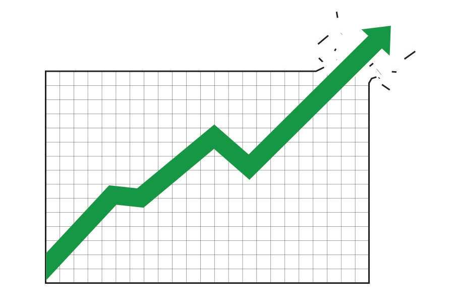
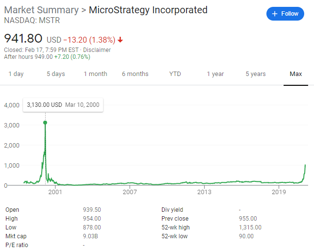
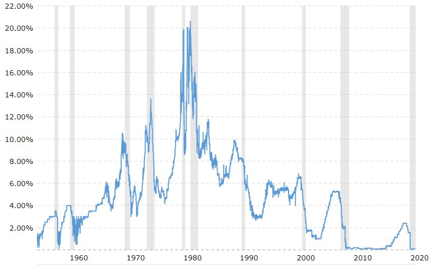
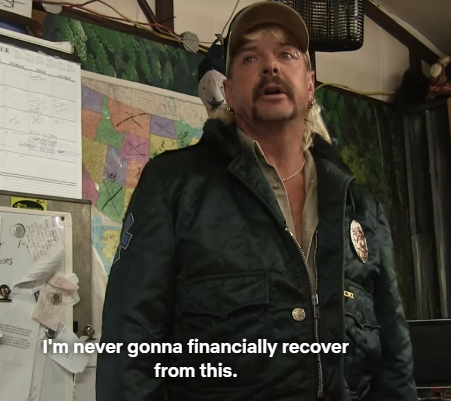

I've been having some bad feelings about the economy recently. I see trillions of dollars hot off the Covid presses without the inflation rate budging, interest rates back down to basically nothing, price to earning ratios at insane heights, and stock charts that look like cartoon graphics.

And it all makes me feel a little nervous. So I did some digging.

>**This is not financial advice**
>
>This is not an in depth analysis. These are my casual observations.

## Price to Earnings

I've been getting into options trading recently, so I've been doing some homework. During my research, I came across charts and lists of [Price to Earnings ratios](https://www.investopedia.com/terms/p/price-earningsratio.asp).

Very basically, P/Es is the number you get when you divide a company's share price by the companies earnings per share. This number is used by investors and amateur gamblers to gauge a company's relative value.

Let's take a look at the current and historical [PE of the S&P 500](https://www.multpl.com/s-p-500-pe-ratio).

Since **1880** the mean and median PE of the S&P 500 is around 15. It is currently at 40, which is the third highest it's ever benn. But that's just the trailing 12 month average.

For a slightly different picture, we can switch over to the [Shiller PE](https://www.multpl.com/shiller-pe) which is the "inflation adjusted 10 year average". That's a pretty different chart. It's showing that we're currently at the second highest, which is 15% **higher** than where it was on [Black Tuesday](https://en.wikipedia.org/wiki/Wall_Street_Crash_of_1929).

This isn't what initially caught my eye. Like I said, I had been looking through PE charts, and some of the numbers are [incredibly high](https://www.marketbeat.com/market-data/high-pe-stocks/).

Remember, the current average is 40. At the time of writing this, MicroStrategy's PE Ratio is **7,848**, Peloton is 1,989, and Tesla is 1,602. Why does it matter?

From an [Investopedia article about PE](https://www.investopedia.com/investing/use-pe-ratio-and-peg-to-tell-stocks-future/) I found an explanation.

>"The average P/E for the S&P 500 has historically ranged from 13 to 15. For example, a company with a current P/E of 25, above the S&P average, trades at 25 times earnings."

Every article about PE will also very carefully mention that high PE doesn't always indicate an overvalued stock. But if we take their explanation, is Tesla really worth 1,560 times earnings? Even [Elon Musk says no](https://www.dw.com/en/tesla-shares-tumble-as-musk-says-companys-stock-is-overvalued/a-53308317).

Look at MicroStrategy, with their astronomical PE. In the past year, the stock price has increased about **900%**. When was the last time that happened? Funny you should ask! Between mid 1999 and mid 2000, the price jumped over **3,000%**, from about $100 to $3130. And then in a few short months the price dropped to $25 thanks to the [dot.com bubble](https://en.wikipedia.org/wiki/Dot-com_bubble).

Hmm, that upward curve on the righthand side of the chart looks awfully familiar.

## Interest Rates

The Federal Reserve interest rates have been so low, for so long. Take a look at [this chart](https://www.macrotrends.net/2015/fed-funds-rate-historical-chart).

The interest rate was lowered during Obama's term in direct response to the housing market crash in 2008. It stayed under 0.2% for years. During Trump's term, the rate was increased back up to 2%, but we're back down to almost 0% thanks to COVID.

Just look at the rest of the chart. The interest rate has never been this low for this long. Not even close.

But why is this interest rate important? As with anything related to the economy, the full answer is multi-faceted and includes a lot math.
<!-- /// -->
<!-- The important thing to remember is that  -->
Its influence and effects include, but are not limited to, the interest rates of bank loans, credit cards, mortgages, and most importantly the value of the US dollar.

### US Dollar Value

The value of the US Dollar has been [falling for months](https://finance.yahoo.com/chart/UUP/). The value of the US Dollar compared to foreign fiat has underpinned the US economy for decades, and that value has decreased. The Federal reserve has failed to keep the country's debt leveled. They've failed to raise interest rates. They've printed a boatload of money. We're seeing

The recent dramatic increase in value of silver, gold, and cryptocurrencies suggest a decrease in confidence of fiat.

**Debt makes the world go round**
The entire economy is quite literally propped up by fact that wages have been stagnant for 50 years, but consumer credit has steadily increased. To put it simply, people in have been earning less, but spending more - constantly.

This inversely proportional relationship is the sustenence that banks, Wall Street, and others thrive on. If the value of the dollar decreases and interest rates rise, purchasing power and standard of living will sharply fall.

### Housing Costs

Taking a step back, let's look at the housing market, where the interest rate plays an important role.

Let's say you want to buy a home that costs $300,000. At an interest rate of 2%, your monthly payments will be $964. Over a 30 year mortgage, the total amount you'll pay is $347,040.

If we increase the interst rate to 6%, your monthly payment will almost double to $1798 and the total amount you'll pay is $647,280.

<!-- Here's a chart that might be easier to read.

**$300,000 House**
| Interest Rate| Monthly Payment|Total $ Over 30 yrs |
|--------------|----------------|--------------------|
| 2%           | $1,108         |$398,880            |
| 6%           | $1798          |$647,280            |

And we can do the same calculations for any price house and see how ridiculous the difference in payments are when the interest rates change by even a few percent.

**$500,000 House**
| Interest Rate| Monthly Payment|Total $ Over 30 yrs |
|--------------|----------------|--------------------|
| 2%           |1,848           | $665,280            |
| 6%           |2,997           | $1,078,920         | -->

When people go to the bank to get a loan to purchase a house, they're looking at the monthly payment, not the total cost. So they speak with the loan officer and figure out how much they can afford each month, and that's what they get approved for.

If we divide the 2% interest monthly cost by the 6% interest monthly cost, we see that a 4% interest increase translates to an almost 40% increase in monthly cost. Could you afford it if your mortgage suddenly increased by 40%? Most people can't.

Does this sound familiar? Well, it should because this is what happened in the 2008 housing market crash. It's more complicated than "interest rates went up, monthly payments went up", but that was the outcome.

### Financial Crisis of 2008

What happened in 2008 is worth mentioning here, because it's still relevant today. The 2008 crash was directly caused by wanton deregulation that allowed for speculation on mortgage backed securities.

There are plenty of resources online that go deeper into all of the things that went wrong in 2008, but here's a summarized version.

After September 11th, the Fed lowered the interest rates from about 6% down to 1% to boost the economy. It did, and it caused the housing market to trend upwards rapidly.

Of course Wall Street took notice, and quickly figured out a way to parasitize this sudden boom. This blood sucking came in the form of mortgage backed securities. Very basically, banks would bundle a bunch of (eventually) dishonestly labeled "low-risk" mortgages together, and sell them. These are the Mortgage Backed Securities, and the Collateralized Debt Obligations (CDOs) you've probably heard about.

The problem was that these securities were both insanely profitable, and barely regulated. So naturally, a race to the bottom started. Banks didn't really care about the individual mortgages, all of them just got lumped together in giant steaming piles of CDOs and pawned them off to hedge funds, investments banks, etc.

In order to get their hands on more mortgages to sell, banks started approving loans that were increasingly risky. It didn't matter if you could actually afford the house, they were practically giving away mortgages.

There are a lot of moving parts and history lessons embedded in the whole "lack of regulation" claim, but there were a few important parts to note.

In 2004 the SEC relaxed the capital requirements for investment banks, allowing them to increase investment leverage.

Additionaly, the [Commodity Futures Modernization Act of 2000](https://en.wikipedia.org/wiki/Commodity_Futures_Modernization_Act_of_2000) exempted derivatives from regulation and supervision. In a wonderful stroke of serendipity, [Credit Default Swaps](https://en.wikipedia.org/wiki/Credit_default_swap), a derivative, had no clearing house as of 2008. This meant there was no body to ensure that parties upheld their obligations in their CDS contracts, there way nobody making sure they could even pay what they owed.

The fed raised the interest rate in 2006, and predictably many people were unable to pay their mortgages. They defaulted on their mortgages which meant the underlying value of the mortgage backed securities decreased.

The banks and hedge funds were essentially playing musical chairs with this bad debt, and nobody wanted to buy or sell from each other. The underlying value of the securities continued to lose value and quickly became worthless, which triggered an avalanche of bankruptcies that was estimated to cost $10 trillion in lost economic output.

Fun side note, [Lehman](https://en.wikipedia.org/wiki/Bankruptcy_of_Lehman_Brothers) [Brothers](https://knowledge.wharton.upenn.edu/article/the-good-reasons-why-lehman-failed/) underwrote the majority of the mortgage-backed securities. By 2007, their portfolio was at around $80 billion, which was **four times** its shareholder's equity. At that time they were also leveraged 30 to 1. Also known as "incredibly susceptible to housing market fluctuations". Here's an interesting paper that goes over [Lehman Brother's bankruptcy](https://som.yale.edu/sites/default/files/files/001-2014-3A-V1-LehmanBrothers-A-REVA.pdf).

Another side note, why is that that every time there's a financial issue, some actors were overleveraged? Maybe nobody should be able to buy or sell things that they don't own, or that don't exist. That sounds like it makes sense, right?

### The Great Wall Street Scam

Unless you've been living under a rock, you've heard about the huge debacle that was `$GME`. If there is one single good thing to come out of this, it's that the general public finally had a glimpse into
just how disgustingly manipulative, incestuous, and dishonest the media and Wall Street is.

We saw news stations running stories that were obviously fabricated by some hedge funds, investment banks, etc. There were interviews with brokerage executives essentially admitting to market manipulation. And worst of all, the actual reason for (all of this) was only allowed to occur because **the SEC is useless**

**Naked Shorts**

Short selling is (essentially) when you bet a stock will go down. You sell a stock you don't own by borrowing and immediately selling a stock. You must return this borrowed stock, so you eventually must buy the stock back. If the price goes down, you will be buying the stock back at a lower price than you initially sold it for, and so you will make money. Conversely, you will lose money if the price goes up.

The key point here is that you are **borrowing** a stock.

Naked short selling is when you short a stock, but you are unable to find any shares to borrow. This happens often with "hard-to-borrow" shares. So what happens in this case? Well, if you're a big money hedge fund, you're cozy enough with some brokerages to be on a "cooks me breakfast in the morning" basis. So naturally, these brokerages will just **lie about the borrowing**.

This is a scam. It's a scam that is enabled by the SEC, the regulators, and the clearing houses.

In the case of Gamestop, the stock's short sales were 140%. As in, short sellers had sold 40% more shares of Gamestop than there were in existance.

>Retail investors are incapable of doing this because they lack the capital, and thus the relationship, with the brokerages.

We can see how this is a compounding issue if we take a look at exactly how brokerages carry this out. Instead of physically "borrowing" the shares, they would "locate" them, and then say "We know where the shares are, so we can buy them whenever we want." Except multiple brokerages can "locate" the same shares multiple times. So when the time comes to actually buy the shares back, they don't exist.

These shares never existed. They're called "fradulent shares". We can plainly see this when over a million Gamestop shares were marked "failed-to-deliver", which means purchasers never recieved the shares they ordered.

Another fun fact is that market makers like [Citadel](https://www.citadelsecurities.com/) are exempt from needing to actually locate the shares. Market makers must accept all buy and sell orders, and so aren't required to comply with many of the rules related to naked short selling.

### CONCLUSION?

What'sa the point of explaining all this (??????)

The point(???) is that

This is all happening again. List of trump doing bullshit.

And they're right back at it!
In the past four years, regulations have slowly been eroded away, and that allows the same people that screwed the economy to do it again. (sources)

If anyone tells you that regulation is bad, I suggest looking up fire brigades in the 1800's. They were often comprised of local gangs who would either set fires themselves to drum up business, or get in violent brawls with rival brigades over who had the right to put out the fire while your house burned. (links) (picture)

Want a more recent example? Texas fought long and hard to separate themselves from the rest of the US power grid. The weather there was recently unseasonably cold in the single digits, weather that the northern half of the country calls "winter", and it caused blackouts and some electricity bills to cost thousands of dollars due to their **unregulated** nature.

It's almost as if the **climate** is **changing**, and that there should be regulations for critical, basic necessities like power.

### Next

But that outcome is what's important. What happens if the interest rates go up soon? Will people be unable to pay their mortgages, causing a chain reaction like in 2008?

Let's look at the chart again. Notice the crazy peak, and subsequent drop of the 1970s-1980s? Low interest rates in the early 1970's boosted the economy, increased employment, but also caused high inflation. The Fed tried to fight this high inflation with higher interest rates, culminating in the insane interest rate of 22% in 1980 and 1981.

Does *this* sound familiar, too? Well, it should! We recently just pulled about $3.5 trillion out of thin air in the form of Covid relief. To put that in perspective, our 2019 federal spending was $4.4 trillion.

Let's look at the amount of money we actually printed.

///link

According to 0000, 20% of **all** US Dollars ever printed, were printed this year. **A fifth**. Just look at that chart.

So where's the inflation?

write about how banks and 00000 artificially keep prices low, rates diff, spending ratio, whatever.

We've had economic expansion for the past decade. That doesn't normally happen. Stock prices have been going up, and interest rates have been near zero for a decade. That's not sustainable. It's not real. You can't just grow indefinitely, there has to be a breaking point.

And Covid did not cause a crash. The market dropped 30% for seemingly no time at all, rebounded, and is again at all time highs. And again, the stock market is not indicative of overall economic health. Sure some people were out of work, and some businesses closed, but it's a drop in the bucket. Millions of people received unemployment benefits, businesses received stimulus aid, most people are still going to work, they still have their homes. No, Covid did not caush a crash.

But we've been throwing around fake money and atrificially propping up the market and the economy for way too long. There will be a crash, and it will be far worse than 2008.

/////////

Would you like to be even more angry?
"Credit Scores" weren't even a thing until 1989.

Video
https://www.youtube.com/watch?v=ikp0Qfgxmkc

<!-- "Millenials" are the first generation since the great depression to be worse off than their parents.(check fig)

Home ownership in people under 35. Purchasing power is at an all time low. -->

<!-- ///
Story about rockefeller selling his stocks after shoeshine boy gave stock tips.

When your mom's friends are posting on facebook about a stock or about bitcoin, that usually means it's time to sell

/////
The stock market is not an indicator how "how well the economy is doing" no matter how much people who have no idea how the economy works likes to think. -->

In summary, we're in the middle of a pandemic, and businesses and housing markets have been disrupted, people are out of work and half a million have died. We've printed a ton of money, the interest rate has been almost zero for the majority of the past thirteen years, and inflation has been kept artificially low. The stock market has seen unprecedented growth. We've seen a lot of post-2008 regulations walked back. And everything keeps going up.

Do you know what else is defined by unbridled growth? Cancer. The important difference is that we can't fix the economy by selectively irradiating certain parts of it.

This will end badly. Maybe not for a few years, and it most likely won't be the end of the world, but I feel like we'll see another crash soon enough. No matter the amount of hand waving you'll get as people try to explain away why we're fine, it certainly doesn't look good. What's the best way to short the US economy?

////