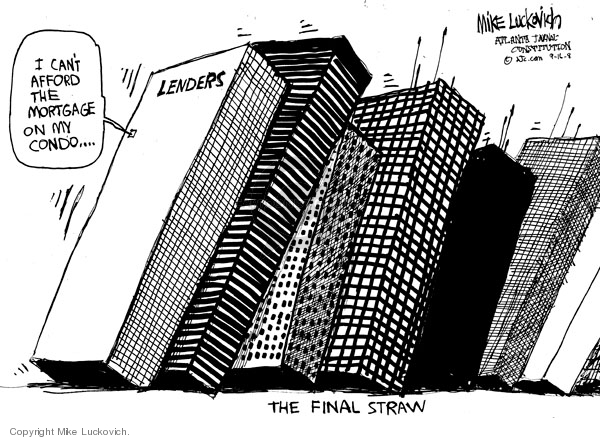
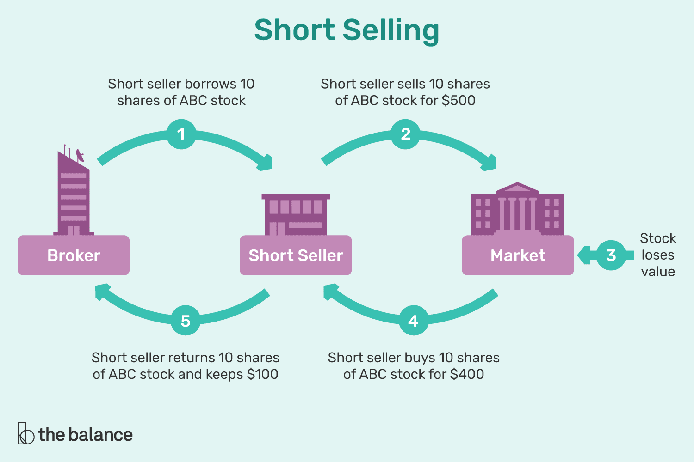

I've been having some bad feelings about the economy recently. Trillions of dollars hot off the Covid presses without the inflation rate budging, interest rates down to basically zero, price to earning ratios at insane heights, and stock charts that look like cartoon graphics.

And it all makes me feel a little nervous. So I did some digging.

> **This is not financial advice**
>
> This is not an in depth analysis. These are my casual observations.

## Price to Earnings

I've been getting into options trading recently, so I've been doing some homework. During my research, I came across charts and lists of [Price to Earnings ratios](https://www.investopedia.com/terms/p/price-earningsratio.asp).

Very basically, P/Es is the number you get when you divide a company's share price by the company's earnings per share. This number is used by investors and amateur gamblers to gauge a company's relative value.

Let's take a look at the current and historical [PE of the S&P 500](https://www.multpl.com/s-p-500-pe-ratio).

Since **1880** the mean and median PE of the S&P 500 is around 15. It is currently at 40, which is the third highest it's ever been. But that's just the trailing 12 month average.

For a slightly different picture, we can switch over to the [Shiller PE](https://www.multpl.com/shiller-pe) which is the "inflation adjusted 10 year average".

According to this chat, we're at the second highest position, which is 15% **higher** than where it was on [Black Tuesday](https://en.wikipedia.org/wiki/Wall_Street_Crash_of_1929).

This isn't even what initially caught my eye. Like I said, I had been looking through company PE charts, and some of the numbers are [incredibly high](https://www.marketbeat.com/market-data/high-pe-stocks/).

Remember, the current average is 40. At the time of writing this, MicroStrategy's PE Ratio is **7,848**, Peloton is 1,989, and Tesla is 1,602. Why does it matter?

Here's an [Investopedia article about PE](https://www.investopedia.com/investing/use-pe-ratio-and-peg-to-tell-stocks-future/) showing why this is important.

> "The average P/E for the S&P 500 has historically ranged from 13 to 15. For example, a company with a current P/E of 25, above the S&P average, trades at 25 times earnings."

Every article about PE will also very carefully mention that high PE doesn't always indicate an overvalued stock. But if we take their explanation, is Tesla really worth 1,560 times earnings? Even [Elon Musk says no](https://www.dw.com/en/tesla-shares-tumble-as-musk-says-companys-stock-is-overvalued/a-53308317).

What about MicroStrategy, with their astronomical PE? In the past year, the stock price has increased about **900%**. When was the last time that happened? Funny you should ask! Between mid 1999 and mid 2000, the price jumped over **3,000%**, from about $100 to $3130. And then in a few short months the price dropped to $25 thanks to the [dot.com bubble](https://en.wikipedia.org/wiki/Dot-com_bubble).

That upward curve on the right hand side of the chart looks awfully familiar.

## Interest Rates

The [Federal Reserve interest rates](https://www.macrotrends.net/2015/fed-funds-rate-historical-chart) have been so low, for so long.

The interest rate was lowered during Obama's term in direct response to the housing market crash in 2008. It stayed under 0.2% for years. During Trump's term, the rate was increased back up to 2%, but we're back down to almost 0% thanks to COVID.

Just look at the rest of the chart. The interest rate has never been this low for this long. Not even close.

But why is this interest rate important? As with anything related to the economy, the full answer is multi-faceted and includes a lot of math.

Its influence and effects include, but are not limited to, the interest rates of bank loans, credit cards, mortgages, and most importantly the value of the US dollar.

### US Dollar Value

The value of the US Dollar has been [falling for months](https://finance.yahoo.com/chart/UUP/). The value of the US Dollar compared to foreign fiat has underpinned the US economy for decades, and that value has decreased.

The Federal reserve has failed to keep the country's debt leveled. They've failed to raise interest rates. They've printed a boatload of money. Recently we've seen a dramatic increase in value of silver, gold, and cryptocurrencies, which often suggest a decrease in confidence in fiat.

**Debt makes the world go round.**

The entire economy is quite literally propped up by fact that wages have been stagnant for 50 years, but consumer credit has steadily increased.

To put it simply, people in have been earning less, but spending more, constantly.

This is the sustenance that banks, Wall Street, and others thrive on. If the value of the dollar decreases and interest rates rise, purchasing power and standard of living will sharply fall.

### Inflation

What happens if the interest rates go up soon? Will people be unable to pay their mortgages, causing a chain reaction like in 2008? We'll get back to that.

In the interest rate chart above, we see the crazy peak, and subsequent drop of the 1970s-1980s. Low interest rates in the early 1970's boosted the economy, increased employment, but also caused high inflation. The Fed tried to fight this high inflation with higher interest rates, culminating in the insane interest rate of 22% in 1980 and 1981.

This inversely proportional relationship between interest rate and inflation is important. We recently just pulled about $3.5 trillion out of thin air in the form of Covid relief. To put that in perspective, our 2019 federal spending was $4.4 trillion.

[20% of **all** US Dollars ever printed, were printed this year](https://www.cityam.com/almost-a-fifth-of-all-us-dollars-were-created-this-year/). **A fifth**. That's pretty crazy.

So where's the inflation?

> While recent stimulus measures might not directly boost prices for consumers, some say it is causing inflation in other places like the stock market or housing market.

There's no free lunch. You can't just print trillions of dollars with no repercussions. Just because it didn't cause hyperinflation doesn't mean it didn't or won't have an effect somewhere else.

## Housing Costs

Taking a step back, let's look at the housing market, where the interest rate plays an important role.

Let's say you want to buy a home that costs $300,000. At an interest rate of 2%, your monthly payments will be about $1108. Over a 30 year mortgage, the total amount you'll pay is $398,880.

If we increase the interest rate to 6%, your monthly payment will increase to $1798 and the total amount you'll pay is $647,280.

When people go to the bank to get a loan to purchase a house, they're looking at the monthly payment, not the total cost. So they speak with the loan officer and figure out how much they can afford each month, and that's what they get approved for.

If we divide the 2% interest monthly cost by the 6% interest monthly cost, we see that the 4% interest increase translates to an almost 40% increase in cost. Could you afford it if your mortgage suddenly increased by 40%? Most people can't.

Does _this_ sound familiar? Well, it should because this is what happened in the 2008 housing market crash. It's more complicated than "interest rates went up, monthly payments went up", but that was a large part of the equation.

## Financial Crisis of 2008

What happened in 2008 is worth mentioning here, because it's still relevant today. The 2008 crash was directly caused by wanton deregulation that allowed for speculation on mortgage backed securities.

There are plenty of resources online that go deeper into all of the things that went wrong in 2008, but here's a summarized version.

After September 11th, the Fed lowered the interest rates from about 6% down to 1% to boost the economy. It worked, and it caused the housing market to trend upwards rapidly.

Of course Wall Street took notice, and quickly figured out a way to parasitize this sudden boom. The blood sucking came in the form of mortgage backed securities.

Banks would bundle a bunch of (eventually) dishonestly labeled "low-risk" mortgages together, and sell them. These are the [Mortgage Backed Securities](https://www.investopedia.com/terms/m/mbs.asp), and the [Collateralized Debt Obligations (CDOs)](https://en.wikipedia.org/wiki/Collateralized_debt_obligation) you've probably heard about.

The problem was that these securities were both insanely profitable, and barely regulated. So naturally, a race to the bottom started.

Banks didn't really care about the individual mortgages, all of them just got lumped together in giant steaming piles of CDOs and pawned them off to hedge funds, investments banks, etc.

In order to get their hands on more mortgages to sell, banks started approving loans that were increasingly risky. It didn't matter if you could actually afford the house, they were practically giving away mortgages.

### Lack of Regulations

There are a lot of moving parts and history lessons embedded in the whole "lack of regulation" claim, but there were a few important parts to note.

In 2004 the SEC relaxed the capital requirements for investment banks, allowing them to increase investment leverage.

Additionally, the [Commodity Futures Modernization Act of 2000](https://en.wikipedia.org/wiki/Commodity_Futures_Modernization_Act_of_2000) exempted derivatives from regulation and supervision. In a wonderful stroke of serendipity, [Credit Default Swaps](https://en.wikipedia.org/wiki/Credit_default_swap), a derivative, had no clearing house as of 2008. This meant there was no regulatory body to ensure that parties upheld their obligations in their CDS contracts. Nobody was making sure they could even pay what they owed.

The Fed raised the interest rate in 2006, and predictably many people were unable to pay their mortgages. They defaulted on their mortgages which meant the underlying value of the mortgage backed securities decreased.

The banks and hedge funds were essentially playing musical chairs with this bad debt, and nobody wanted to buy or sell from each other. The underlying value of the securities continued to lose value and quickly became worthless, which triggered an avalanche of bankruptcies that was estimated to cost $10 trillion in lost economic output when the dust settled.

[Lehman](https://en.wikipedia.org/wiki/Bankruptcy_of_Lehman_Brothers) [Brothers](https://knowledge.wharton.upenn.edu/article/the-good-reasons-why-lehman-failed/) underwrote the majority of the mortgage-backed securities. By 2007, their portfolio was at around $80 billion, which was **four times** its shareholder's equity. At that time they were also leveraged 30 to 1. Also known as "incredibly susceptible to housing market fluctuations". Here's an interesting paper that goes over [Lehman Brothers bankruptcy](https://som.yale.edu/sites/default/files/files/001-2014-3A-V1-LehmanBrothers-A-REVA.pdf).

Why is it that every time there's a financial issue, it's caused by either severe overleveraging or a lack of regulation? Maybe nobody should be able to buy or sell things that they don't own, or that don't exist. That sounds like it makes sense, right?

Unfortunately, in the last four years we saw [regulations rolled back](https://prospect.org/economy/trump-s-assault-financial-reform/), and [people that are totally unqualified and anti-consumer](https://www.commondreams.org/views/2018/09/20/deregulation-wall-street-plain-and-simple-corruption) installed as head of Consumer Financial Protection Bureau, so it's not as though we're improving.

## The Great Wall Street Scam

Unless you've been living under a rock, you've heard about the huge debacle that surrounded `GameStop`. If there is one single good thing to come out of this, it's that the general public finally had a glimpse into just how disgustingly manipulative, incestuous, and dishonest the media and Wall Street can be.

We saw news stations running stories that were obviously fabricated by some hedge funds, investment banks, etc. There were interviews with brokerage executives essentially admitting to market manipulation. And worst of all, this all went on unimpeded because the SEC has no teeth.

> The primary purpose of the SEC is to enforce the law against market manipulation.

That's right in the first line of [the SEC's wiki page](https://en.wikipedia.org/wiki/U.S._Securities_and_Exchange_Commission). I don't know what's going on because they certainly aren't fulfilling their primary purpose.

### Naked Shorts

Short selling is when you sell a stock you don't own by borrowing and immediately selling it because you bet the stock will go down. You must return this borrowed stock, so you eventually must buy the stock back.

If the price goes down, you will be buying the stock back at a lower price than you initially sold it for, earning you the difference. Conversely, you will lose money if the price goes up.

The key point here is that you are **borrowing** a stock.

Image you have a share. Your friend borrows it. Then, your friend lends it to one of their friends. There is only one share in existence, yet 2 shares are owed. One to you, and one to your friend. In real life there are millions of shares being bought, sold, and lent back and forth.

In the case of GameStop, the stock's short sales were 140%. This means short sellers had sold 40% more shares of GameStop then there were in existence. This was the crux of the issue. If, for some reason, every single person needed to repay their obligations at the same time, it would be physically impossible since 40% of those shares didn't exist.

> Retail investors are usually incapable of doing this because they lack the capital, and thus the relationship, with the brokerages.

Naked short selling is when you short a stock, but you are unable to locate any shares to borrow. This happens often with ["hard-to-borrow"](https://www.investopedia.com/terms/h/hardtoborrowlist.asp) shares.

So what happens in this case? Well, if you're a big money hedge fund, you're cozy enough with some brokerages to be on a "cooks me breakfast in the morning" basis. So naturally, these brokerages will just **lie about locating the shares**.

This is illegal. Some people will say this doesn't happen **because** it's illegal, and it's easier to make money through other legal loopholes, so why would they risk it?

I'd normally agree, but looking at the history of weak enforcement of these laws by the SEC, companies clearly breaking the law and facing no repercussions, why **wouldn't** they?

It's not like the presence of laws stops people from breaking them. When billions of dollars are on the line with a risk of needing to pay a couple million dollars in fines, the benefits greatly outweigh the risk.

Plus the reality is that what's going on is closer to a legal loophole than outright lying and breaking the law in regards to naked short selling.

An especially salient point is that market makers like [Citadel](https://www.citadelsecurities.com/) are exempt from needing to actually locate the shares. Market makers must accept all buy and sell orders, so they aren't required to comply with many of the rules related to naked short selling.

The existence of [dark pools](https://www.investopedia.com/articles/markets/050614/introduction-dark-pools.asp) further muddy the waters. These are publicly inaccessible, opaque exchanges where more than half of all trades occur.

Think internal trading between two brokerages, where the trades aren't required to be cleared by a clearing house or the [DTCC](https://en.wikipedia.org/wiki/Depository_Trust_%26_Clearing_Corporation).

The reason why it's even possible that a stock was shorted over 100% is because the brokerage's "lying about borrowing" is a compounding issue.

Instead of physically "borrowing" the shares, they would "locate" them, and then say "We know where the shares are, so we can buy them whenever we want." Except multiple brokerages can "locate" the same shares multiple times. So when the time comes to actually buy the shares back, they don't exist.

We can plainly see this when over a million GameStop shares were marked "failed-to-deliver", which means purchasers never received the shares they ordered.

This is known as Counterfeit stock. [This webiste](http://counterfeitingstock.com/CS2.0/CounterfeitingStock.html) goes into a lot more detail. It doesn't contain sources, but gives more of an overview, definitions, and explanations.

So you have market makers pretending to locate shares, executing trades in a system that nobody can see, and stocks with 140% short interest. There's a problem here.

## Regulation

What does the housing crisis and the high GameStop short interest have in common? A lack of regulation.

I don't blame the hedge funds, the investment banks, or the brokerages. They are all acting in their best interest, with the pursuit of profit, _usually_ within the confines of the law. Although when they do break the law, the fines imposed on them are less than their profit, so it's worth it and that's just the cost of doing business.

The lack of regulations, and lack of enforcing existing regulations is the problem.

Some people might parrot some line about how "regulations are bad and stifle growth", but that's a manipulation. Regulations that prevent giant companies from robbing us are necessary. It's a lie perpetuated by, you guessed it, companies. I wonder why they would do that?

It's the exact same scenario with unions. People died fighting for the right to not have to work 18 hour days, get paid fairly, and for the right to form unions. Yet many people will try to argue that unions are bad and should be avoided.

Sure, there are some terrible unions that are useless, but that shouldn't blind you to the fact that there are plenty of unions that greatly benefit the employees. Unions are why some people can retire comfortably, or get wage increases. Unions are why a cop can shoot a baby in the face and still get a full pension, while non union employees can get fired for no reason and are lucky to get reasonable health insurance and $8 an hour.

Trainees at large corporations are forced to watch anti-union videos as a part of their training. How could you seriously believe the company is doing that for the benefit of the **employee**?

So don't believe similar lies about regulations. Companies cannot be trusted to do anything other than make more money. They can't be trusted to not [use child slaves](https://www.businessinsider.com/apple-knowingly-used-child-labor-supplier-3-years-cut-costs-2020-12), [pollute our water](https://www.aquathin.com/company-fined-82-million-clean-water-act-violation), or [sell sawdust bread](https://www.marketplace.org/2017/11/01/how-wood-got-our-food-then-out-it-then-back-it-again/), so how can you trust them to have consumer's best interests at heart?

There are countless examples showing the consequences of a lack of regulations.

Take [fire](https://www.boweryboyshistory.com/2014/02/at-ready-history-of-new-york-city-fire.html) [brigades](https://www.windsorfire.com/a-brief-history-of-firefighting/) in the 1800's for example.

They were often local gangs that would either set fires themselves to drum up business, or get in violent brawls with rival brigades over the right to put out the fire while your house burned.

What about a more recent example? [Texas fought long and hard](https://www.utilitydive.com/news/the-real-problem-in-texas-deregulation/595564/) to separate themselves from the rest of the US power grid. The weather there was unseasonably cold and in the single digits. Weather that the northern half of the country calls "winter". It caused blackouts and some electricity bills cost thousands of dollars due to their **unregulated** nature.

You can't outright trust any company to ever do the "right thing" over the "profitable thing". That's not to say there are no virtuous companies. They do exist, but they're the exception. This is why we need more regulation to control companies from doing whatever they want all the time.

The issue is that pure [capitalism is unsustainable](http://web.missouri.edu/~ikerdj/papers/Is%20Capitalism%20Sustainable.htm). Capitalism is defined by unbridled growth. Do you know what else is defined by unbridled growth? Cancer. The difference is that we can't fix the economy by selectively irradiating certain parts of it.

Unfortunately, the second you mention that capitalism is unsustainable, people crawl out of the woodwork to cry about "socialism". As if the only two options we have are to consume all of our resources, or Karl Marx's wet dream. It's like some people don't understand the word nuance.

Establishing sustainable processes and enacting heavy regulations would be a good start on the path to retain capitalism without the whole "destroy the whole planet for a dollar" thing we currently have going on.

## Conclusion

I don't have a conclusion, and I don't have a solution.

We've had economic expansion for more than the past decade. That doesn't normally happen. Stock prices have been going up, and interest rates have been near zero for more than a decade. That's not sustainable. You can't just grow indefinitely, there has to be a breaking point.

Covid did not cause a crash. The market dropped temporarily, rebounded, and is again at all time highs. Regardless, **the stock market is not indicative of overall economic health.** Sure some people were out of work, and some businesses closed, but that's a drop in the bucket. Millions of people received unemployment benefits, businesses received stimulus aid, most people are still going to work, they still have their homes.

We've been throwing around fake money and artificially propping up the economy for too long. We're kicking the can down the road. There will be a crash, and it will be far worse than 2008.

This will end badly. Maybe not for a few years, and it most likely won't be the end of the world, but I feel like we'll see another crash soon enough. No matter the amount of hand waving you'll get as people try to explain away why we're fine, it certainly doesn't look good. What's the best way to short the US economy?

