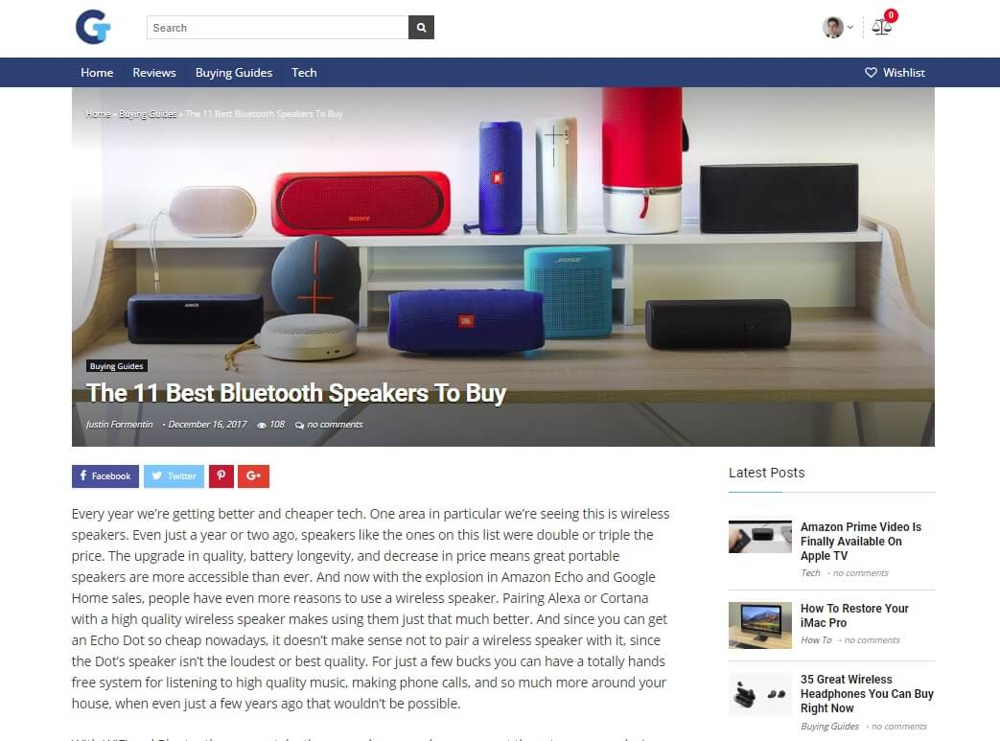

## Background
Started a new droplet in Digitalocean with Ubuntu 16.04. SSH-ing into the droplet, installed Apache2, and then installed and configured PHP7 and MySQL. Acquired SSL Certificate. Managed files through SFTP.

Technology news and review website. Designed and built website, wrote all the copy. Managed analytics and on-page advertising. Managed facebook ad campaign.

