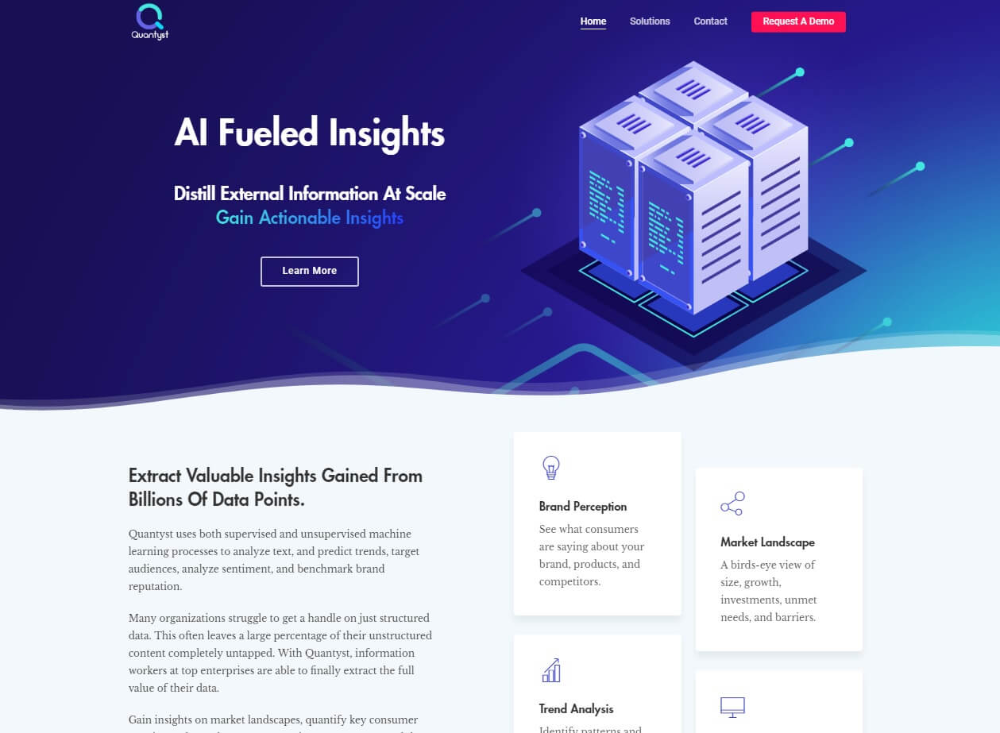

---
customer:
title: "Data Startup - Quantyst"
path: "quantyst"
cover: "./a1.jpg"
date: "2018-08-02"
chunk: "Website for data SaaS company"
task: "React, News API, SCSS"
time: "https://quantyst.com"
---
## Background
Quantyst is a data company that uses both supervised and unsupervised machine learning processes to analyze text, and predict trends, target audiences, analyze sentiment, and benchmark brand reputation.

### Text Analytics
Aggregate billions of data points from millions of sources.

### Social Analytics
Sort through the noise and build a true picture of how individual customers interact with your brand. Aggregate social media mentions, analyze sentiment, identify behavioral triggers, reduce churn, uncover points of friction, improve brand reputation, and increase revenue.

### Marketing Analytics
Condense all of your marketing channels , reducing complexity and increasing ROI by helping you to actually make use of all your data.

Harness the power of advanced machine learning algorithms to extract actionable insights, discover patterns, and make predictions.

