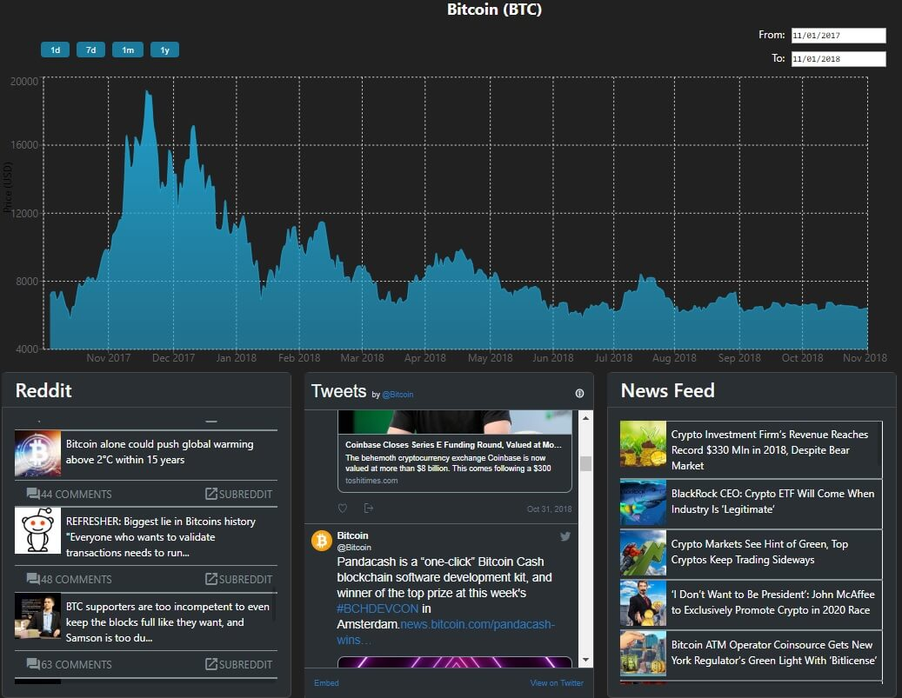

## Background
A Cryptocurrency app that has just the most important information grouped together. Current price, market cap, and percent change listed in a chart on the main page. Price chart with custom date range, subreddit, twitter, and news feed on each of the coin’s pages.

