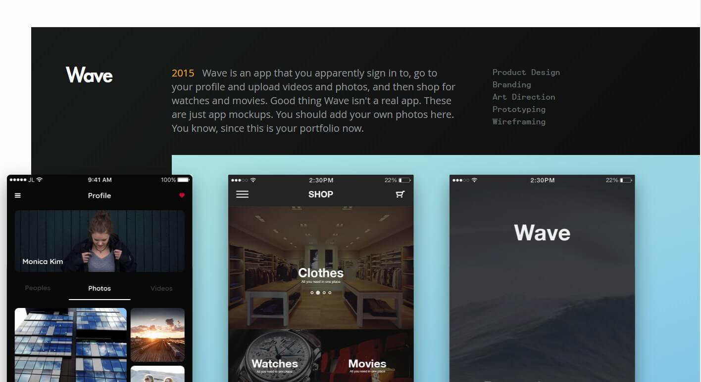

## Background
- Full Portfolio Template site that you can replace with your information.

- Utilizes Vue, Vue-Router, Webpack, Sass, to build modern boilerplate

- Has Service-workers. Is fully responsive; works on all devices

