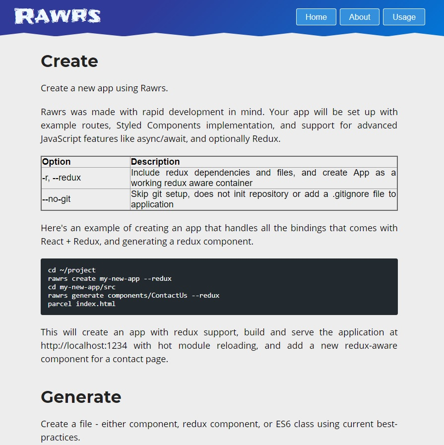

## Background
Rawrs is a command line utility for React. It was made in an attempt to add to and improve the React ecosystem. It has much more functionality than Create React App, but much less than other, application specific boilerplates. This makes Rawrs the perfect choice for developers that are new to React.

Rawrs gives you the ability to quickly add components to your project. Create functional or class components, with the option of adding redux.

You can find the code and guide on my Github and visit the website by following the links.

## Features
Rawrs has 5 main features:

- React-Routing- Such a necessary feature in many applications, Rawrs has routing implemented with example routes in the example scaffolding.

- Styled-Components- While other options such as SCSS are great, Styled Components enforces best practices- Small components, single use class names, splitting components and containers.

- Code Generation- Rawrs allows you to create components in the command line. This is something that other frameworks/libraries have, but is rare in the React ecosystem for some reason.

- ParcelJS- Rawrs is set up using ParcelJS, a zero configuration web application bundler that is much more user-friendly than webpack.

- Redux- Getting started with Redux is often difficult for beginners, so Rawrs has an option to build your app with Redux, helping by setting up the basic structure.

