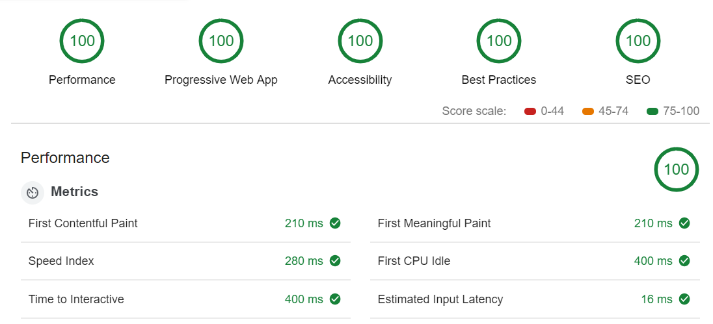

## Background
I wrote an step-by-step guide on how to build a site using Gatsby starting with a blank folder all the way to production.

In the article, I outline the code that I use and explain each part of Gatsby, and how it all works.

The site scores 100 in all categories for Google's Lighthouse Audit.

You can read the guide [in my post.](https://justinformentin.com/guide-to-building-a-gatsby-site)