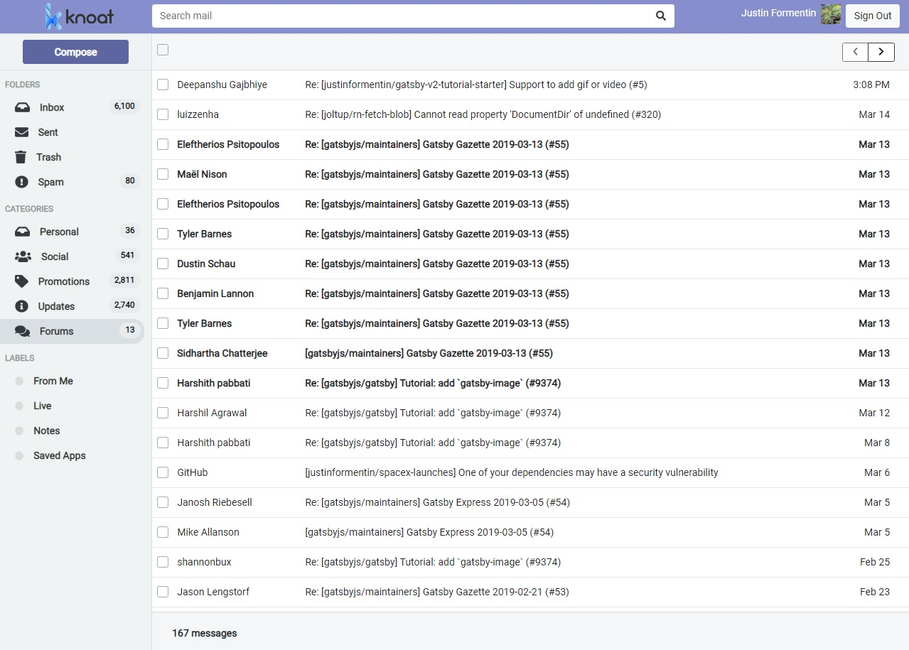

## Background
Simple Gmail client built using [React](https://github.com/facebook/react) and [Redux](https://github.com/reduxjs/redux). Pulls data from [Gmail's RESTful API](https://developers.google.com/gmail/api/). Allows users to read, reply, send, and delete emails.

Authentication is entirely handled by Gmail for security. Knoat doesn't store or persist any user or account data, and the application only fetches the data from Gmail's API.

