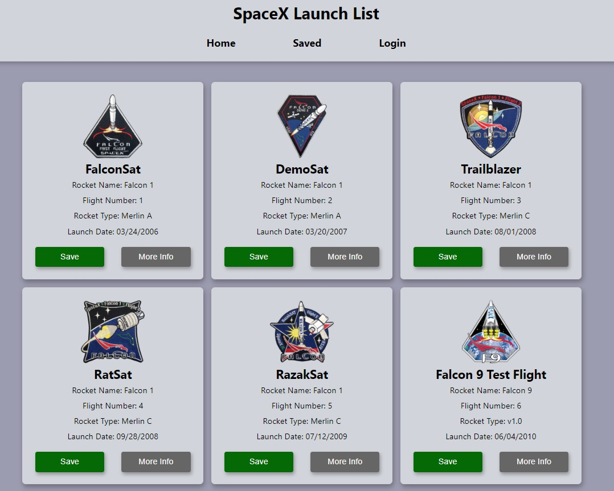

## Background
Spacex Launches is an app that pulls data in from SpaceX's API and displays it on the home page. You can save individual launches by clicking the save button. The data will be saved into Mongo, and will be displayed on the Saved page. Saved launches can also be deleted by clicking the Remove button.

There is functional user authentication using Redux, Passport, JWT, and bcrypt-hash. Of course, if this was a production application, using an off-the-shelf authentication system is very often preferable.

